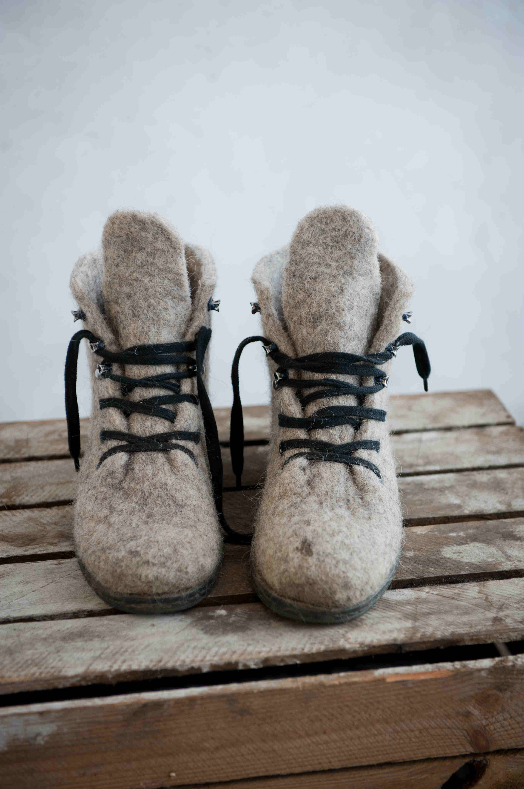

### Marchés 
Retrouvez À pas feutrés sur les marchés:

- Au Marché Des Saveurs d'Avioth, chaque premier dimanche du mois.
- Sur la boutique en ligne de le [*Comptoir des laines*](https://comptoirdeslaines.be/shop/a-pas-feutres-boutique?flag=1)

 
### Ateliers 2017-2018 feutre    

En collaboration avec le Centre Culturel de Rossignol

**Sam. 28 octobre à Sommethonne: Bijoux.** 
Une journée créative autour des bijoux.
Vous aurez l'occasion de fabriquer des parures colorées et fleuries selon vos goûts.  
**Sam. 18 novembre à Sommethonne: Chaussons.**
Réalisation d'une paire de chaussons 100% laine en une seule forme grâce au feutrage à l'eau.  
**Sam. 24 février à Sommethonne: Chapeaux.** 
Atelier chapeaux haute couture... sans couture.
Créer le chapeau de vos rêves, aussi fou soit-il!  
**Sam. 17 mars à Sommethonne: Sacs** 
Réalisation d'un sac créatif et coloré, 100% laine.
 
Matériel à apporter: un essui, une bouilloire, un tablier imperméable, son pique nique et un seau. 

Inscriptions :
[Centre Culturel Rossignol-Tintigny](http://www.ccrt.be/)

  

<!--p class="rss-subscribe">s'inscrire au <a href="{{ "/feed.xml" | prepend: site.baseurl }}">flux RSS</a></p-->
