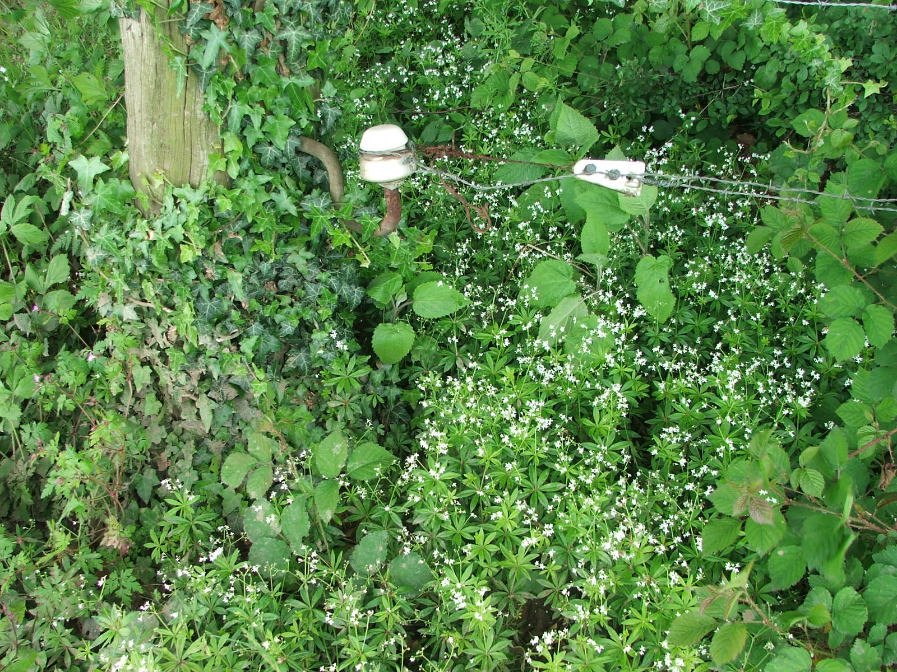

**Plasticienne d'origine rurale**, j'aime aller chercher la **matière première dans les fermes de la région**. Il s'y cache **des laines originales et passionnantes à travailler**.

**Je m'approvisionne en direct chez les éleveurs** ou par les **différents projets** qui se sont développés **pour valoriser la laine locale**, comme Bergelaine, dans le nord de la province du Luxembourg.

Depuis quelques mois, une nouvelle collaboration s'est mise en route: **Ell'laine**. A partir de la rencontre avec un éleveur (Thierry Mulders) et moi même, il a découlé le projet de tranformation à plus grande échèlle. Grâce à la Filière Laine, nous avons trouvé plusieurs personnes pour se joindre à nous dans ce beau défi. Vous pouvez retrouver nos péripéties sur [notre site](http://www.ell-laine.com/). Nous avons aujourd'hui un beau feutre 100% circuit court et un catalogue de produits en ligne.
  

**À pas feutrés, pour garder le contact avec la terre, tout en ayant la tête dans les étoiles !**

[*Liens*](/liens/)

