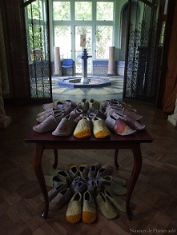

**Plasticienne d'origine rurale**, j'aime aller chercher la **matière première dans les fermes de la région**. Il s'y cache **des laines originales et passionnantes à travailler**.

**Je m'approvisionne en direct chez les éleveurs** ou par les **différents projets** qui se sont développés **pour valoriser la laine locale**, comme Bergelaine, dans le nord de la province du Luxembourg ou la Laine des Coccinelles en Gaume, ainsi que chez un ami tondeur.

La laine est lavée en Belgique (Filature du Hibou ou Traitex) et cardée en Belgique ou au Grand Duché du Luxembourg (Filature du Hibou et Musée de la draperie d'Esch-sur-Sûre).

Pour la coloration, j'ai différentes manières de travailler. La première est une recherche de valorisation des laines colorées naturellement, des laines noires, grises, voir brunes. 
Ensuite pour varier les couleurs, j'utilise les colorants Greener shades,d'origine chimique mais sans métaux lourds. Et de temps à autres, je fais des teintures végétales, avec du prunelier ou de la tanaisie par exemple, en fonction des rencontres.

Je confectionne ensuite les chaussons dans mon atelier.

Là aussi,je travaille de deux manières. 

**Les chaussons adultes sont confectionnés sans couture**, grâce à une technique de « moulage », spécifique au feutrage à l'eau. Ces chaussons continuent à « se former » autour du pied apportant un délicieux confort et une chaleur parfaite.

**Les chaussons enfants sont cousus au départ de plaques de feutre.** Ces dernières sont fabriquées par des machines chez différentes artisanes belges (La feutrerie, la Filature du Hibou) avec ma selection de laine. Je les couds dans mon atelier. **Un élastique autour de la cheville leurs donne un bon maintien au tour du pied, tout en étant facile à enfiler.**

Pour tous les chaussons, la semelle est composée de latex naturel. 

L'ensemble de deux matières laine et latex gardent vos pieds à l'abri du froid, en leur laissant  toutes les libertés !

**À pas feutrés ce sont des chaussons pour garder le contact avec la terre, tout en ayant la tête dans les étoiles !**

[Liens](/liens/)

