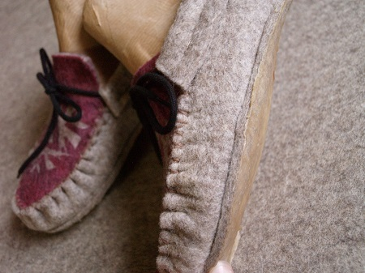

**Comment entretenir vos chaussons pour les garder longtemps ?**

La semelle des chaussons est composée de plusieurs couches de latex, il faut renouveler celui-ci avant que le feutre ne soit usé. Pour cela, vous pouvez reprendre contact avec moi.
 
**Comment laver vos chaussons ?**

Les chaussons sont lavables en machine, programme laine ou à la main.

