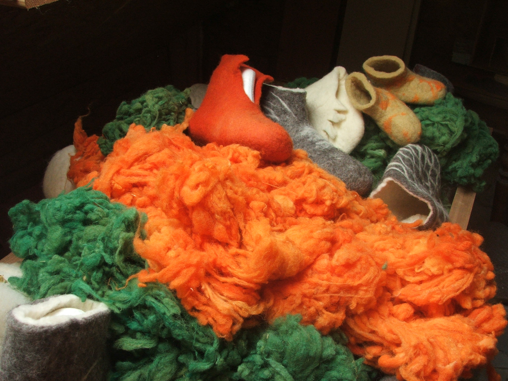

Comment entretenir vos chaussons pour les garder longtemps ?

La semelle est composé de plusieurs couches de latex, il faut renouveler celui-ci avant que le feutre ne soit usé. Pour cela, vous pouvez reprendre contact avec moi.
 
Comment laver vos chaussons ?

En programme laine, tout simplement ou à la main.

