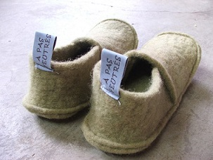
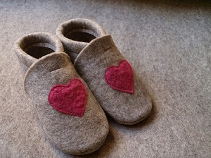

Nouveau : 
4 créatices/ 1 tonne de laine

À pas feutrés s'est associé à 2 autres créatices pour un nouveau défi 100% laine locale. L'objectif: valoriser 1 tonne de laine brute en produits finis.
La laine provient d'un élevage à Nassogne. Elle a été feutrée début 2017 en Allemange. Nous proposons une collection de produits finis grâce à notre catalogue en ligne. Au menu: trousses, sacs, tapis,... et bien sûr, des chaussons!!!

Suivez-nous sur notre page [*Facebook*](https://www.facebook.com/Elllaine-1810238132545396/) et sur [notre site](http://www.ell-laine.com/)

**Retrouvez-nous au Salon Valériane à Namur du 1er au 3 septembre**

  
  

  <!--p class="rss-subscribe">subscribe <a href="{{ "/feed.xml" | prepend: site.baseurl }}">via RSS</a></p-->

