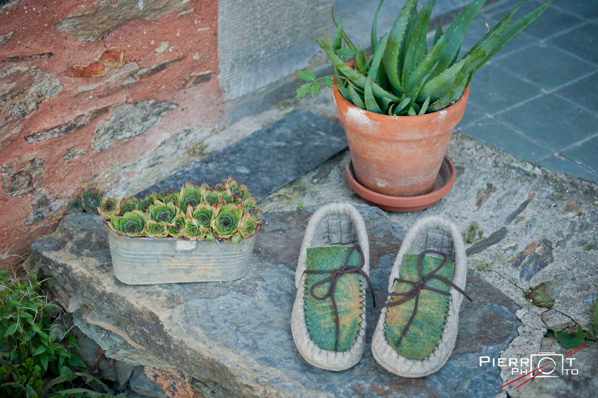

À pas feutrés, une gamme de chaussons et d'accessoires 100% laine de mouton issue de circuit court. Le tout est tranformé par la magie du feutrage, à l'aide de teintures naturelles pour les impressions. C'est la valorisation d'une matière noble et saine, dont vos pieds apprécieront toutes ses qualités (chaleur agréable, souplesse, respiration,...) !

**Nouveau : [Boutique en ligne sur le *Comptoir des laines*](https://comptoirdeslaines.be/shop/a-pas-feutres-boutique?flag=1)** !

  
  

