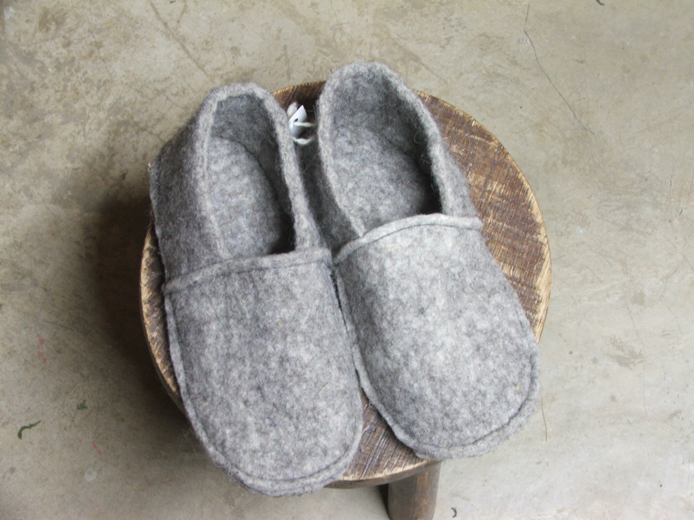

De nouvelles aventures pour À pas feutrés!

Le projet [**Ell'laine**](/www.ell-laine.com/)  a démarré.
Ell'laine, ce sont 4 créatrices, un éleveur et beaucoup de laines. Oui, oui, beaucoup. Style une tonne! Et le meilleur, c'est que c'est de la laine 100% locale. Notre éleveur est situé à Nassogne, en Province du Luxembourg.

Suivez-nous sur notre page [*Facebook*](https://www.facebook.com/Elllaine-1810238132545396/) et sur [Ecobole](https://www.ecobole.eu/fr), notre plateforme de précommande pour être les premiers à soutenir notre beau projet.

  
  

  <!--p class="rss-subscribe">subscribe <a href="{{ "/feed.xml" | prepend: site.baseurl }}">via RSS</a></p-->

