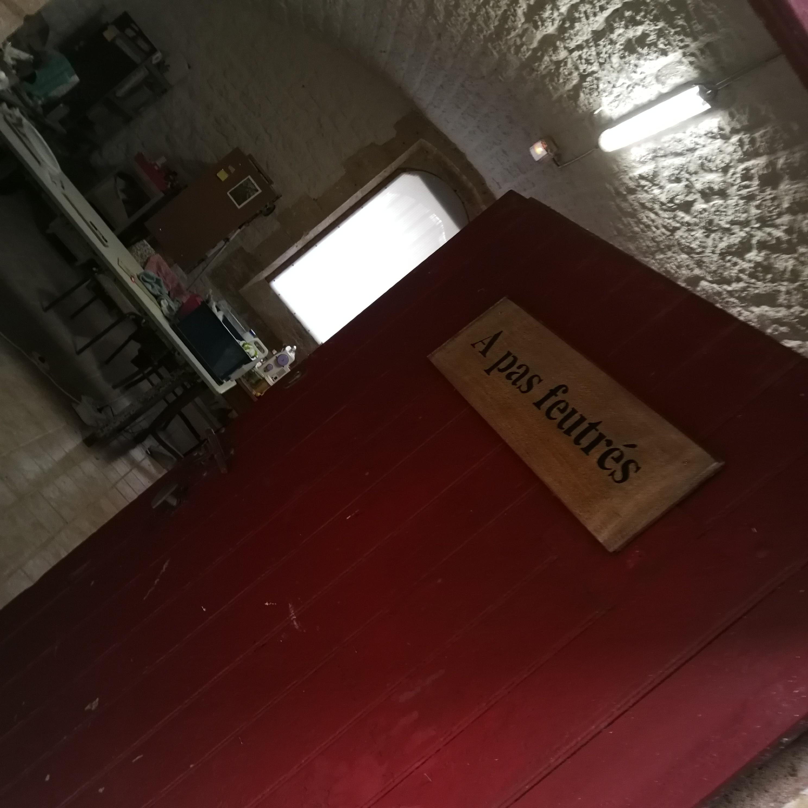

À pas feutrés, une gamme de chaussons et d'accessoires 100% laine de mouton issue de circuit court. Le tout est tranformé par la magie du feutrage, à l'aide de teintures naturelles pour les impressions. C'est la valorisation d'une matière noble et saine, dont vos pieds apprécieront toutes ses qualités (chaleur agréable, souplesse, respiration,...) !

### Mon atelier de fabrication se trouve, désormais, à la Citadelle de Montmédy, avec un espace d'exposition/boutique. Vous pouvez m'y retrouver les vendredis et samedis de 13h30 à 18h. J'y suis également certains dimanches ensolleillés!

J'y propose des animations, de manière régulière, voir [Actualités](https://www.apasfeutres.be/actus/)

[Ateliers créatifs](https://www.ccrt.be/stages) autour du feutre

Au plaisir de vous y retrouver!

  
  

