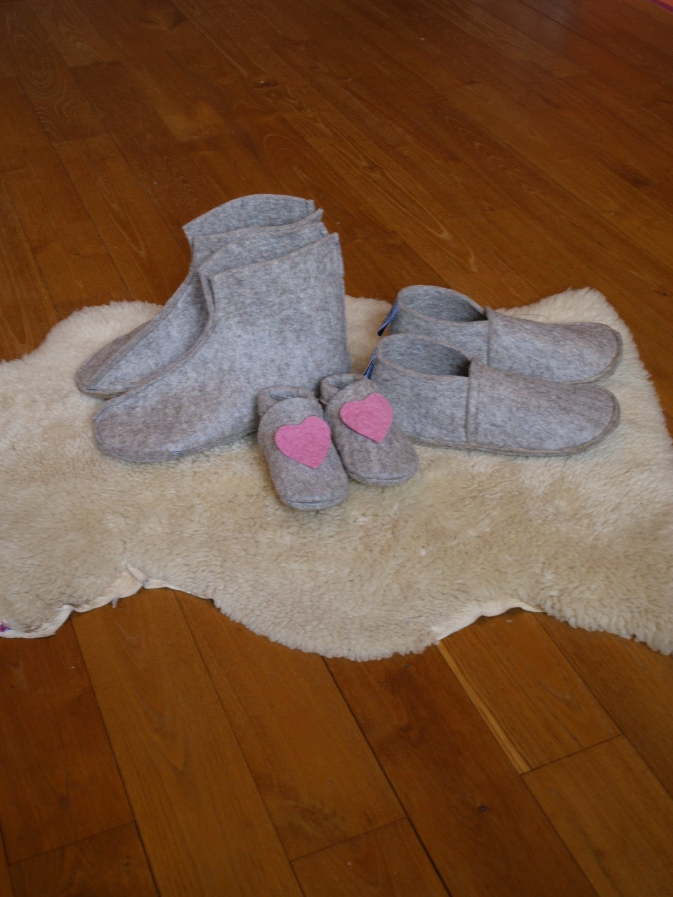

Nouveau : A pas feutrés s'associe à d'autres créatrices pour un nouveau défi: [**Ell'laine**](/www.ell-laine.com/) .

Ell'laine, ce sont 4 créatrices, un éleveur et une tonne de laine. De la laine 100% locale qui provient d'un élevage est situé à Nassogne, en Province du Luxembourg, le tout transformé en feutre gris beige.
Au menu: chaussons, lampes, sacs , galettes de chaises et encore d'autres surprise! 

**Retrouvez-nous au Salon Valériane à Namur du 1 au 3 septembre**

Suivez-nous sur notre page [*Facebook*](https://www.facebook.com/Elllaine-1810238132545396/) et sur [notre site](http://www.ell-laine.com/), 

  
  

  <!--p class="rss-subscribe">subscribe <a href="{{ "/feed.xml" | prepend: site.baseurl }}">via RSS</a></p-->

